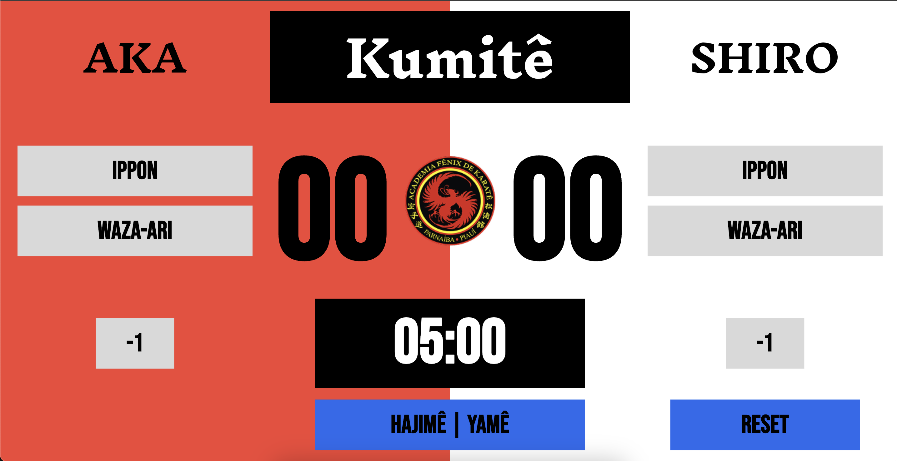

# 🥋 Kumitê Score

**Kumitê Score** é um placar digital responsivo para combates de Karate (Kumitê), desenvolvido com Flutter. Ele permite controlar o tempo de luta, pontuações (Ippon e Waza-Ari) para ambos os atletas (Aka e Shiro), e emite um som ao final do tempo.

Ideal para uso em tablets ou computadores em competições ou treinos.

---

## 📸 Preview

 <!-- Adicione um print se quiser -->

---

## ✨ Funcionalidades

- ⏱ Temporizador de 5 minutos com seletor de tempo configurável
- 🎵 Emissão de som ao final da luta
- 🟥🟥 Pontuação separada para "AKA" e "SHIRO"
- 🎯 Botões de pontuação: IPPON (2 pts), WAZA-ARI (1 pt)
- 🧩 Totalmente responsivo para web ou tablet em paisagem
- 🔊 Suporte a áudio via `audioplayers`

---

## 🚀 Instalação

### 1. Clone o repositório

```bash
git clone https://github.com/rkpontes/kumite_score_flutter.git
cd kumite_score
```

### 2. Instale as dependências
```dart
    flutter pub get
```

### 3. Adicione a fonte e o som
Certifique-se de que os seguintes arquivos existam:

```bash
    assets/fonts/BebasNeue-Regular.ttf
    assets/sounds/boxing-bell.mp3
```

E estejam listados no seu pubspec.yaml:

```yaml
flutter:
  assets:
    - assets/sounds/boxing-bell.mp3

  fonts:
    - family: Bebas Neue
      fonts:
        - asset: assets/fonts/BebasNeue-Regular.ttf
```

### 4. Rode o projeto
```bash
flutter run -d chrome
# ou
flutter run -d windows
# ou em tablet/telefone
flutter run
```

## 🧪 Como usar
Clique no timer para escolher o tempo da luta (1 a 10 minutos).

Clique em Hajimê | Yamê para iniciar ou pausar o cronômetro.

Use os botões IPPON (2 pts) e WAZA-ARI (1 pt) para adicionar pontuação.

O botão Reset reinicia o tempo e as pontuações.

O som é reproduzido automaticamente ao final da contagem regressiva.

## 🛠️ Tecnologias
- Flutter
- flutter_screenutil
- audioplayers

## 📂 Estrutura de Arquivos
```bash
lib/
├── main.dart
├── src/
│   ├── app/
│   │   └── kumite_score/
│   │       └── kumite_score_page.dart
│   └── components/
│       └── app_button.dart
assets/
├── fonts/
│   └── BebasNeue-Regular.ttf
└── sounds/
    └── boxing-bell.mp3
```

## 📃 Licença
Este projeto é de código aberto. Sinta-se à vontade para usar, modificar e distribuir.

## 🤝 Contribuição
Sugestões, melhorias ou correções são bem-vindas! Abra uma issue ou envie um pull request.

## 🥋 Oss!
Desenvolvido com foco em praticidade para artes marciais.